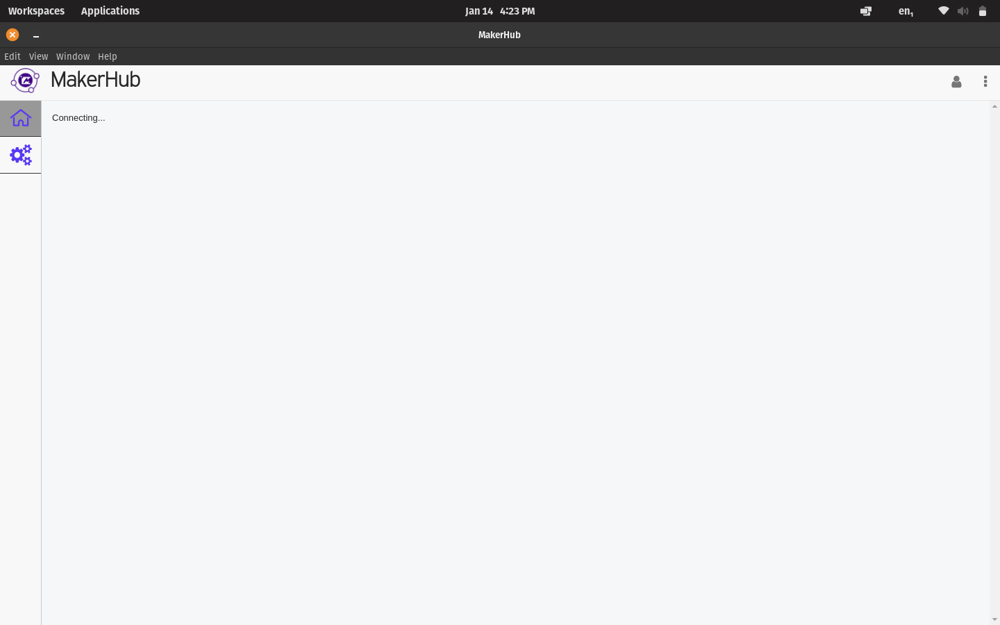

This one really hurt...

# F*#@ MakerMade

## Yeah, You Read That Right

F*#@ MakerMade.
The appropriate reaction is best suited by a picture of Linus Torvalds flipping the bird to NVIDIA, so here it is.

I have never seen a company so genuinely bad at supporting their own product.
Even Dassault Systems has the decency to stop selling a product when they no longer support it.
If you know how much heartburn Dassault has given me, you'd know this experience must have been really, really bad.

## Let Me Explain

[MakerMade is a somewhat unauthorized fork of the Maslow project](https://www.youtube.com/watch?v=0TiDxp82jCQ&pp=ygUlbWFzbG93IGFuZCBtYWtlcm1hZGUgYXJlIG5vdCB0aGUgc2FtZQ%3D%3D).
The MakerMade M2 is an attempt to commercialize and improve the Maslow project.
A friendly reminder that most open-source projects allow for commercial use; however, they typically must attribute the source.
It seems MakerMade has done a poor job of separating themselves from the Maslow project.

I bought my M2 kit on eBay because I firmly believe there are some things that you should always buy used.
My checklist for determining these items is:

1. Relatively expensive.
2. Lose a chunk of their value immediately after purchase.
3. See little to no use which results in little to no wear.

Examples of these are bicycles, musical instruments, exercise equipment, and CNC machines.
Thus, I bought my M2 used and saved a ton of money over MSRP.
The kit had never been assembled, and nothing was missing from the box.
It seemed like a solid buy.

## "Open-Source"

Maslow uses the Arduino Mega board.
MakerMade uses the Arduino Due board.
The software that the nice folks at Maslow wrote is only compatible with the Mega.
The software that the "you-know-whats" at MakerMade wrote is compatible with both the Mega and the Due.
On the other side of that, if you use a MakerMade M2, then you are forced to use the software from MakerMade, called "Makerverse".

Makerverse is "open-source".
[Its source code is on GitHub with a GPL-3.0 license](https://github.com/makermadecnc/makerverse).
However, I put it in quotes because it hasn't been touched in almost 3 years.
It has not been updated since fall of 2021.

A friendly note: open-source projects die all the time.
People don't like working for free, there will be jerks online, and maintainers will often decide to pass the flame to someone else.
*However, this case is different.*

## There's Just One ~~Little~~ Giant Problem

In this case, MakerMade is taking money for a product that requires another product to work, but that other product is not actively being supported.
I'd like to be clear:
I don't see this as poor open-source behavior (although some of their other behavior could be), but this is absolutely poor business behavior.

This is incredibly problematic because MakerVerse blocks users from using the app if there is no connection to the external services.
Yet, the services that it tries to connect to have all been shut down.
Simply put: there is no offline mode, and there is no current way to use the application because the online mode doesn't work either.

That's when I realized...

## You Need MakerVerse to Calibrate Your Machine

Yes, you absolutely need MakerVerse to calibrate your machine.
Once again, the M2 is not compatible with the other options that are available to Maslow users.
Again, MakerVerse is the only software that can calibrate your M2, and you absolutely must calibrate your machine if you expect to have any practical use out of it.

So here I am...

> I am f*#@ed.

## A Glimmer of False Hope

I researched online and look for others having the same issue.
[I finally started to see that people have complained about MakerVerse](https://forums.maslowcnc.com/t/is-makerverse-still-alive/18368).
Some noted that they're bypassing the login screen by snipping out the code.
This seemed reasonable.
I try to build with npm since the project was written in TypeScript.
Failure.
I noted the repo has a Dockerfile, so I try to build with Docker.
Failure.
The repo is so old that dependencies are no longer valid.

Side-note: This is exactly why we use [nix](https://nixos.org/). People still need to build things even when some amount of time has passed.

That's when it really kicks in:

> I am royally f*#@ed.

## A New Glimmer of False Hope

I started researching more and came across a [random forum post](https://forums.maslowcnc.com/t/alternative-to-makerverse/19377) with [a link](https://forums.maslowcnc.com/t/alternative-to-makerverse/19377/14) to a fork of MakerVerse's replacement, [MakerHub](https://github.com/sourceryltd/makerhub-releases/releases/tag/makerhub1.2.0).
Of course, at this time it's just MakerVerse with the login screen disabled, but I had hope it would allow me to accomplish the absolute minimum of calibration.
Oh, and did I mention it has a `.deb` installation file in the release?
Things were looking like they were starting to turn around for Connor.

I installed MakerHub, connected everything, and updated my board firmware.
I realized at this point that MakerHub does not have the ability to recognize my board since it can't reach out to online services:

`Could not download from the community catalog. You will need to create a new machine, below.`

I wasn't panicking yet since there was a `Create a New Machine` button below.
Yet, if you click on it, you'll just hang on a screen with the label: `Connecting...`.

That's when I finally accepted it...

> Oh dear, I am completely f*#@ed.

## How Did We Get Here?

Once again, the do-nothings from Reddit strike again.
*The internet is flooded with people offering opinions but who have never actually taken the time to try anything.*
There are lots of people saying their opinions about the product, but if anyone in the last year and a half had actually used the product, they would have written down the simple obvious answer to the question of "Is the M2 an OK buy?":

> "This thing doesn't even work anymore because the tooling supporting it is no longer supported".

Note that I didn't walk into this as an uneducated consumer.
I read as much as I possibly could months before purchasing my kit.
Since very few people actually try anything for themselves and so many blog posts are now written by robots, the information that I needed to know was nowhere to be found.

So here's *your* warning sign (and I hope that you have the decency to link this page everywhere you can, so Google can actually pick this message up):

*Do not do business with MakerMade. They have made it abundantly clear that they do not care about the consumer, and they are __still__ selling a product that they are not even supporting*

## The Cost

I am out over $1,000.
I refuse to sell this to some poor sap because I have a moral compass, unlike MakerMade.
The projects that I had in mind for a router are shelved for now.

However, it could be worse.
The positive things I can focus on are:

* I purchased this kit used from eBay, so I did not pay MSRP.
* I now have a DeWalt 611 router that I can easily find another use for.
* I now have a laser module that I can likely find another use for.

## Lessons Learned

> There's a moral to this story... somewhere...

I can't believe I have to write this down 🤦.

1. Design your application such that it can be used when connections fail and clients are offline.
2. Force yourself to make the core functionality of your application usable when *your* services fail (because even "five nines" is still not 100%).
3. Try to plan such that the application is buildable even when you are no longer able to support. It might be plagued with security vulnerabilities, but it needs to be buildable.

## Conclusion

* *F*#@ MakerMade*.
* Support Maslow; they're doing great stuff and should be recognized.
* Don't trust Reddit (duh).
* Be a decent human and don't sell unsupported garbage to customers.
* Try to do cool stuff; life is too short to worry about failing.

Stay safe out there,

-Connor
